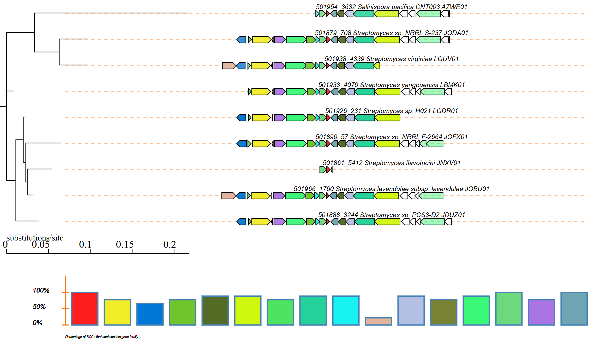

# Tutorial: Setting up and Running CORASON on Windows Subsystem for Linux (WSL)

This guide walks you through installing Miniconda, setting up the CORASON environment, running an example, and viewing the output.

## Prerequisites

- Windows 10 or 11
- [Windows Subsystem for Linux (WSL)](https://learn.microsoft.com/en-us/windows/wsl/) enabled and installed (Ubuntu recommended)

---

## Step 1: Launch WSL

Open your WSL terminal (Ubuntu):

```bash
wsl
```

Update packages:

```bash
sudo apt update && sudo apt upgrade -y
```

---

## Step 2: Install Miniconda

Download the Miniconda installer:

```bash
wget https://repo.anaconda.com/miniconda/Miniconda3-latest-Linux-x86_64.sh
```

Run the installer:

```bash
chmod +x Miniconda3-latest-Linux-x86_64.sh
bash Miniconda3-latest-Linux-x86_64.sh
```

Follow the prompts (accept license, choose install location, allow to initialize Conda).

Close and reopen the terminal or activate conda:

```bash
source ~/.bashrc
```

---

## Step 3: Clone the CORASON Repository

Install `git` if not already available:

```bash
sudo apt install git -y
```

Clone the repository:

```bash
git clone https://github.com/miguel-mx/corason-conda.git
cd CORASON
```

---

## Step 4: Create the Conda Environment

Create the environment using the provided `.yml` file:

```bash
conda env create -f environment.yml
```

Activate the environment:

```bash
conda activate corason
```

Install aditional dependencies
```bash
cpanm SVG
```
---

## Step 5: Uncompress the Example Dataset

Inside the CORASON folder:

```bash
tar xvfz EXAMPLE.tar.gz
cd EXAMPLE
```

---

## Step 6: Run CORASON

Once in the example directory, execute CORASON with a typical command like:

```bash
 ../CORASON/corason.pl -q ctg2_515.query -rast_ids Example.Ids -s 501926

```

#### TODO
corason.pl (main program) is located in ../CORASON
-q ctg2_515.query (query is a FASTA file from the selected Contig from 501926 GBK)
¿How do I select a contig?  
-rast_ids Example.Ids (Is an index of the GBKs created with ....)
-s 501926 : The GBK of the query contig

Make sure you run the command inside the EXAMPLE folder

---

## Step 7: View the Output

CORASON will generate several outputs including:

- `Joined.svg`: A scalable vector graphic of gene cluster relationships and phylogenies.

### To open `Joined.svg`:

From Windows, navigate to the path of your WSL home directory (e.g., `\\wsl$\Ubuntu\home\your-user\...`) and open `Joined.svg` with your preferred browser.

Also, you can open the File Explorer and look for your WSL, and go to  `/home/<user>/corason-conda/EXAMPLE/output/ctg2_515.query-output/` and open `Joined.svg`. 

## Example Output

Below is an example of a CORASON output:




---

## Tips

- Make sure to activate your `corason` environment every time before running.
- Use `conda deactivate` to exit the environment.
- You can install additional tools or dependencies via `conda install` as needed.

---

## References

- CORASON: https://github.com/miguel-mx/corason-conda
- BiG-SCAPE/CORASON publication: https://doi.org/10.1038/s41589-019-0400-9
